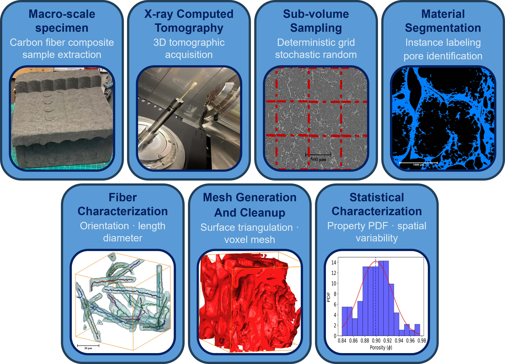

<p align="center">
  
</p>

-----

# HERMES: **H**eterogeneous **E**ffective **R**epresentative **M**ulti-scale property **E**xtraction **S**oftware

[](LICENSE)
[](environment.yml)
[](environment.yml)

HERMES is a Python framework for extracting geometric and statistical descriptors from three-dimensional volumetric microstructure data, especially XRCT datasets.
It provides an integrated workflow for segmentation, sub-volume sampling, voxel-to-surface reconstruction, mesh cleanup, feature extraction, and high-throughput property analysis.
The code is designed for heterogeneous materials where a single bulk average does not capture the variability present across a reconstructed volume.

HERMES can sample many sub-volumes from one or more primary 3D image volumes and compute property distributions for each sampled structure.
It supports interactive use through a PyQt GUI, scripted serial execution, and MPI-enabled execution on HPC systems.

For a complete feature-by-feature reference, see [docs/features.md](docs/features.md).

## Repository Status

This repository is being prepared for public release alongside the HERMES manuscript.
The current code provides a GUI workflow, direct command-line commands, a JSON config runner, a Python API, and an MPI command for distributed processing.
The serial workflow now runs through the package framework rather than edited root-level scripts.
The remaining cleanup work is focused on expanding MPI config execution and making the GUI a visual front end to the same shared backend.
Characterization tests and public documentation are being added as that consolidation continues.

## License

<!-- TODO: Confirm the public-release copyright holder for the MIT License before the first public push. -->

This software is intended to be released under the MIT License.
See [LICENSE](LICENSE).

## Table Of Contents

- [System Requirements](#system-requirements)
- [Installation](#installation)
- [Quick Start](#quick-start)
- [Feature Summary](#feature-summary)
- [Outputs](#outputs)
- [Examples](#examples)
- [Testing](#testing)
- [Documentation](#documentation)
- [Citing HERMES](#citing-hermes)

## System Requirements

- Conda or a Conda-compatible environment manager.
- Python 3.10 through the provided `environment.yml`.
- Enough memory for the selected input volume and sampled sub-volume size.
- Optional MPI support for distributed runs.
- Optional display support for GUI and 3D visualization workflows.

## Installation

Create and activate the recommended Conda environment from the repository root.

```bash
conda env create -f environment.yml
conda activate hermes
```

Verify the installation by running the characterization tests.

```bash
python -m pytest
```

See [docs/installation.md](docs/installation.md) for platform notes and troubleshooting.

## Quick Start

The fastest way to try the unified command-line interface is to run one basic task directly.

```bash
python -m hermes mesh path/to/binary-volume.tif output/volume.stl --voxel-size 1.0
```

For a guided first tutorial with generated data, see [docs/quickstart.md](docs/quickstart.md).

Basic tasks can be run directly:

```bash
python -m hermes segment input.tif segmented.tif --method otsu
python -m hermes mesh segmented.tif mesh.stl --voxel-size 1.0
python -m hermes properties segmented.tif properties.txt --voxel-size 1.0
```

To run the same style of workflow from an editable config file, use:

```bash
python -m hermes run examples/quickstart/config.json
```

### GUI Workflow

Launch the GUI from the repository root.

```bash
python HERMES.py
```

The GUI supports input selection, voxel-size assignment, segmentation, threshold previewing, crop setup, save options, property selection, and voxel rendering.

### Serial Workflow

Use direct CLI commands for basic serial tasks or a JSON config for reproducible multi-step workflows.

```bash
python -m hermes mesh segmented.tif mesh.stl --voxel-size 1.0
python -m hermes run examples/quickstart/config.json
```

See [docs/usage.md](docs/usage.md) for command and config details.

### MPI Workflow

Run the framework MPI command with the desired rank count.

```bash
mpirun -n 4 python -m hermes mpi --input segmented.tif --voxel-size 1.0 --output mpi-output
```

The MPI path is intended for large ensembles of sampled sub-volumes on HPC systems.
The current framework MPI command handles a single input volume.
The remaining MPI cleanup should expand this to full config workflows.
See [docs/mpi.md](docs/mpi.md) for SLURM examples and memory-planning guidance.

## Feature Summary

HERMES includes the following major capabilities.

- TIFF and sparse voxel DAT input support.
- Manual and automatic grayscale segmentation.
- Manual, global, entropy-based, histogram-based, and locally adaptive thresholding.
- Random, deterministic grid, and explicit-corner sub-volume sampling.
- Sampling from multiple primary volumes.
- Marching-cubes surface reconstruction.
- STL, TIFF, DAT, and property-table outputs.
- Laplacian smoothing and screened Poisson reconstruction.
- Mesh validation, repair, and disconnected-island removal.
- Closed volume, surface area, porosity, and volume-to-area ratio.
- Fiber and feature diameter distributions.
- Pore-size distributions.
- Fiber centerline extraction, branch splitting, length, azimuth, and elevation.
- Local direction-map generation for assigning material orientation.
- Directional porosity profiles and 3D blockwise porosity maps.
- Property distribution workflows for many sampled sub-volumes.
- Serial, local parallel, and MPI-enabled execution.
- Memory monitoring and scaling workflows for HPC planning.

The full feature description is maintained in [docs/features.md](docs/features.md).

## Outputs

HERMES can write several output products depending on selected options.

- Cropped or segmented 3D TIFF volumes.
- Sparse voxel `.dat` files.
- STL surface meshes.
- Tab-delimited property tables.
- Fiber direction maps.
- Directional porosity tables and plots.
- MPI profiling and timing outputs.

## Examples

The examples documentation describes reduced workflows that mirror the major HERMES use cases.

- Synthetic fiber validation.
- Fibrous material property distributions.
- Woven C/C property distributions.
- Irregular RTV pore-size distributions.
- Directional porosity mapping.
- MPI scaling studies.

See [docs/examples.md](docs/examples.md).

## Testing

The test suite can be run using `pytest`.

```bash
python -m pytest
```

See [docs/testing.md](docs/testing.md) and [docs/TEST_CATALOG.md](docs/TEST_CATALOG.md) for a plain-language description of the tests.

## Documentation

- [Feature overview](docs/features.md)
- [Installation](docs/installation.md)
- [Quick start](docs/quickstart.md)
- [Usage](docs/usage.md)
- [MPI and HPC usage](docs/mpi.md)
- [Examples](docs/examples.md)
- [Testing](docs/testing.md)
- [Plain-language test catalog](docs/TEST_CATALOG.md)

## Citing HERMES

<!-- TODO: Confirm the final journal target, DOI, repository URL, and publication status before the first public push. -->

Please cite the HERMES article when using this repository in published work.
The bibliographic entry below is a draft and should be updated with the final DOI and publication metadata.

```bibtex
@article{chacon2026hermes,
  title   = {A computational framework for automated microstructure volume generation and property extraction from x-ray computed tomography (XRCT) data},
  author  = {Chacon, Luis A. and Banerjee, Ayan and Stoffel, Tyler D. and Poovathingal, Savio J.},
  journal = {Computational Materials Science},
  year    = {2026},
  note    = {Manuscript in preparation}
}
```
